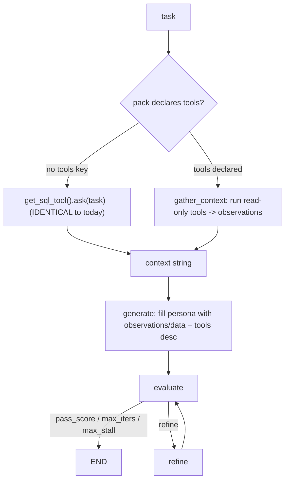

# Plan: Generalize portable-agent for any tool-using agent

## 1. Context (what I explored, and the exact seams)

Verified against the current tree (commit `97a49ae`, 77 tests green). This repo is the **platform**; agents are consumed through the existing endpoint/CLI path — no UI belongs here.

**SQL-specific assumptions, located precisely:**

- **Tool contract** — `engine/sql_tool.py`: `SQLTool` Protocol `ask(question: str) -> str` (line 14); factory `get_sql_tool(use_case, default)` (line 162); adapters `CortexAnalystTool`, `GenieTool`, and `MockSQLTool` (per-pack `fixtures.py`).
- **The single call site** — `engine/graph.py`: `sql = sql or get_sql_tool(...)` (line 222) and `data = sql.ask(s["task"])` (line 233). One pre-fetch; result lands in `State["data"]` (line 180) and fills `{data}` in generate/evaluate/refine.
- **SQL-shaped exemplar loader** — `load_exemplars` (lines 66-75) hardcodes `Q:/SQL:` reading `{question, sql}`.
- **Eval loader** — `run_evals.py` reads `{question, expect_contains}`.
- **Config** — `default_sql_tool` (`shared/config.yaml` line 8); shells set `SQL_TOOL`.
- Already domain-neutral (no change): `load_skills`, `fill`, `Verdict`/`parse_verdict`, the loop nodes, `LLMClient`.

**Decisions confirmed with you:** deterministic tool execution (loop shape untouched); lean build + one generic HTTP tool reference; pytest strictly under `tests/`; tool code modular in one package.

**Key security property of the deterministic choice:** because the LLM never selects tools, tool-returned text **cannot trigger tool calls** — prompt-injection via tool output is structurally defanged, not just discouraged.

## 2. Design — a small, typed tool layer in `engine/tools/`

New package, one concern per file (mirrors the existing `llm_client`/`sql_tool`/`tracing`/`memory` seam pattern):

- `engine/tools/base.py` — contracts only: `ToolSpec(name, description, read_only: bool, input_model)`, `ToolResult(ok, output: str, error: ToolError|None, meta)`, `ToolError` (normalized), `ToolContext(timeout_s, run_id, ...)`, `Tool` Protocol (`spec` + `run(input: dict, ctx) -> ToolResult`), plus `bound_output()` and `redact()` helpers.
- `engine/tools/registry.py` — name -> factory registration, `build_tool(name)`, explicit unknown-tool error, discovery listing.
- `engine/tools/dispatch.py` — safe single-tool execution: validate input against `input_model`, enforce timeout, catch/normalize exceptions into `ToolResult`, bound output size, redact secrets, emit one structured log line (name/status/latency/run\_id). Approval gate: side-effecting tools raise unless `approved=True`.
- `engine/tools/orchestrator.py` — `load_tools(cfg)` builds the pack's declared tools; `gather_context(task, tools, ctx)` runs the **read-only** ones (input rendered from pack config with `${task}` substitution), concatenates normalized, labeled observations. Side-effecting tools are loaded/described but NOT auto-run.
- `engine/tools/sql_bridge.py` — `SqlBridgeTool` wraps `get_sql_tool(...)` as a `Tool` (read\_only, input `{question}`) so SQL is **one tool category**, not the engine's assumption.
- `engine/tools/mock_tool.py` — generic deterministic in-process tool (source component, parallels `MockClient`/`MockSQLTool`).
- `engine/tools/http_tool.py` — generic HTTP GET reference: endpoint allowlist, redirect validation, SSRF guard (block private/link-local/metadata IPs + non-allowlisted hosts), secret redaction, bounded retries w/ backoff, timeout, response-size cap; creds from env only; body treated as untrusted text.

### Deterministic flow (loop shape unchanged)

`generate` is the ONLY node touched, and only its context source: existing packs (no `tools:` key) take the byte-identical `get_sql_tool().ask(task)` branch; packs with `tools:` use `gather_context`. `fill()` receives both `{data}` and `{observations}` (same value, back-compat) plus an optional `{tools}` description block. No change to `evaluate`, `refine`, `keep_going`, `State`, scoring, or edges.

## 3. Contract preservation (explicit)

| Contract                           | How it stays intact                                                                         |
| ---------------------------------- | ------------------------------------------------------------------------------------------- |
| generate->evaluate->refine loop    | Only generate's context source branches; nodes/edges/`State` unchanged                      |
| Rubric + /N scoring                | `Verdict`/`parse_verdict`/`max_score`/`pass_score` untouched                                |
| `LLMClient` + adapters + selection | Not imported or altered by the tools layer                                                  |
| Existing SQL packs run unchanged   | No `tools:` key -> legacy `get_sql_tool().ask()` path; `default_sql_tool`/`SQL_TOOL` intact |
| Legacy `{question, sql}` exemplars | `load_exemplars` still emits `Q:/SQL:` for that shape (detected by keys)                    |
| Env config + defaults              | All new env/config keys are additive with safe defaults                                     |

If any step is found to force a behavior change to the loop/scoring/LLMClient/existing packs, I stop and surface it before coding.

## 4. Security requirements -> where each lives

| Requirement                                | Implementation point                                                                         |
| ------------------------------------------ | -------------------------------------------------------------------------------------------- |
| Secrets from env only, never in packs/logs | `http_tool` reads token from env; `dispatch.redact()` scrubs logs/errors                     |
| Least privilege, read-only default         | Only configured tools built; `read_only` defaults true; only read tools auto-run             |
| Side effects explicit + approval           | `ToolSpec.read_only=False` excluded from `gather_context`; dispatch requires `approved=True` |
| Input validation                           | pydantic `input_model` validated in `dispatch` before run; unknown tool/arg -> clear error   |
| Network safety (SSRF)                      | `http_tool` allowlist + redirect validation + private-IP block; no creds-in-URL              |
| Output safety                              | `bound_output()` size cap; normalized; inserted as delimited untrusted observations          |
| Prompt injection                           | Deterministic model = tool output cannot select/trigger tools or grant perms                 |
| Reliability                                | `ToolContext` timeout; bounded retries+backoff and rate limit in `http_tool`/`dispatch`      |
| Observability                              | One structured, redacted log per dispatch: name/status/latency/run\_id                       |

## 5. Implementation steps (incremental; each independently testable)

1. **Contracts** — add `engine/tools/base.py` (ToolSpec/ToolResult/ToolError/ToolContext/Tool + `bound_output`/`redact`). No wiring.
2. **Registry + dispatch** — `engine/tools/registry.py` and `dispatch.py` (validation, timeout, normalized errors, approval gate, redacted structured logging, unknown-tool/bad-args errors).
3. **Adapters** — `sql_bridge.py` (wrap `get_sql_tool`), `mock_tool.py` (source mock), `http_tool.py` (allowlist/redirect/SSRF/redaction/size/timeout/retry); register all.
4. **Orchestrator** — `engine/tools/orchestrator.py`: `load_tools(cfg)` + `gather_context(task)` over read-only tools with `${task}` input rendering.
5. **Minimal graph integration** — in `engine/graph.py` `build_graph`: branch in `generate` (tools declared -> `gather_context`; else identical `get_sql_tool().ask`); pass `{observations}`+`{data}`+`{tools}` to `fill`. Nothing else changes.
6. **Additive loaders/config** — extend `load_exemplars` (accept `{input, tool_calls?, response}` and keep legacy `{question, sql}`); extend `run_evals.py` (accept `{input|question, expect_contains}`); document the `tools:` schema; add safe-default keys to `shared/config.yaml` and `.env.example` (tool timeout, HTTP allowlist).
7. **Example pack** — `usecases/api_assistant/` (generic, non-SQL, creds-free): `config.yaml` declaring **two** tools (mock + http in mock mode) to prove multi-tool; persona `prompts/generate.md`; a non-SQL `skills/*.md`; domain-neutral `exemplars/*.yaml`; non-SQL `evals/golden_set.yaml`; `fixtures.py` canned responses. Illustrative of JIRA/HANA-style agents without being vendor-specific.
8. **Tests + docs + report** — all pytest under `tests/` only (regression, integration, security); concept doc `docs/concepts/tools-and-agents.md` (create a pack, add an adapter, configure creds, run SQL + generic examples); decision entries in `PROJECT_CONTEXT.md`/`CLAUDE.md`; completion report.

## 6. Verification

- `py -3 -m pytest -q` — existing 77 stay green; new tests pass. New coverage:

  - existing SQL packs load+run unchanged (no-tools branch); rubric/`parse_verdict` unchanged; legacy `{question, sql}` AND new domain-neutral exemplars both load.
  - `api_assistant` runs end-to-end with mocks, no credentials; dispatches to **multiple** configured tools.
  - unknown tool / invalid config / invalid args fail with clear errors; timeout, rate limit, oversized response, malformed output handled safely; secrets redacted in logs/errors; HTTP tool blocks non-allowlisted/SSRF hosts and validates redirects.

- `py -3 run_local.py dq_qals` — output identical to today (regression).

- `py -3 run_local.py api_assistant` and `py -3 run_evals.py api_assistant` — non-SQL agent runs via the same CLI/endpoint path.

- Confirm no engine file imports test code and tool logic lives only in `engine/tools/` (+ the one guarded branch in `graph.py`).

## 7. Critical files

- `engine/graph.py` — the single, guarded integration point (generate's context source); everything else in the loop is untouched.
- `engine/tools/base.py` — the typed contracts every adapter implements (new).
- `engine/tools/orchestrator.py` — deterministic `gather_context`; keeps tool logic out of the loop (new).
- `engine/sql_tool.py` — wrapped by `sql_bridge.py`; SQL becomes one tool category, unchanged itself.
- `usecases/api_assistant/config.yaml` — proves declarative multi-tool selection + permissions for a non-SQL agent (new).

## 8. Deferred (explicitly out of scope, to stay lean)

- LLM-driven tool-calling (ReAct) — the deterministic seam is designed so this can be added later behind the same interface without reworking packs.
- Any UI/consumer project (separate repo, calls `/invoke`).
- Vendor-specific connectors (JIRA/HANA/etc.) — pack authors add these using the generic `http_tool` + registry; not shipped here.
