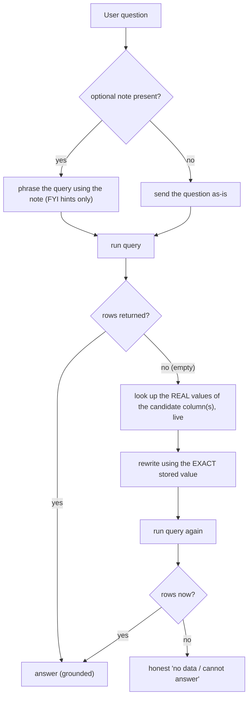

# Plan: reactive value recovery (one coherent translation pipeline)

## Why this exists (the one problem)
Users type everyday words (*active*, *IT Software*, *instruments*); the database stores exact values
(`Executed`/`Approved`, `IT Software`, `Instrument`). Something must translate before the query runs, or
recover when it doesn't. This session solved that three ways in three turns (per-pack note, always-on
lookup, cleanup) — reactive whack-a-mole. This plan settles it as **one layered design** and deletes the
redundancy.

## Target design (agreed)
Three layers, each covering what the one above didn't. Nothing competes.

- **Layer 1 - optional note (`dimension_map.md`):** soft, generic, FYI. It says *which column* a kind of
  value lives in and, at most, *examples* of what a word tends to mean ("*active* usually means in-force
  states like Executed/Approved - for reference"). It is **never** an authoritative value list, so a
  developer who forgets to update it does no harm. Present -> the first query is likely right (fast path,
  no wasted round-trip). Absent -> skip; the safety net covers it.
- **Layer 2 - reactive live lookup (safety net):** fires **only when a query returns empty**. Reads the
  real distinct values from the view, rewrites the question with the exact match, retries once. Zero setup
  beyond naming the candidate column(s); costs nothing on questions that already work. **Live values are
  the single source of truth** - the note is only a hint.
- **Layer 3 - semantic-view enrichment (ideal upstream):** when the data team adds synonyms/sample values
  to the model, Layers 1-2 quietly become unnecessary and native agents benefit too. Out of engine scope;
  we recommend it in docs.

## What changes vs. what I built earlier (net simplification)
- REMOVE the always-on proactive lookup: `_known_values_block()` is no longer called from `_frame_question`;
  `frame.md` loses its `KNOWN VALUES` block and exact-spelling rule.
- MOVE the live values into the **retry** step: `reformulate.md` gains a `{known_values}` section; the value
  fetch happens inside the `is_no_data` loop, lazily and cached (so a session with no empties never fetches).
- KEEP `CortexAnalystTool.distinct_values()` unchanged (just called reactively now), the retry/drift/escalation
  machinery, and the optional notes.
- CONSOLIDATE config: replace the three `frame_discover*` knobs with one reactive knob.

## Implementation steps

1. **Reactive lookup in the retry loop** ([engine/graph.py](engine/graph.py) ~line 680). In the
   `while ... is_no_data(data)` loop, before calling `reformulate.md`, lazily fetch (and cache) the real
   values for the declared candidate columns via `getattr(sql, "distinct_values", None)`; pass them into
   `reformulate.md` as a new `known_values=` kwarg. Remove the `_frame_question` discovery call. Fail-safe:
   no method / off / error -> empty block -> today's plain reword. `_keeps_subject`/`_keeps_pinned` still
   guard the rewrite.

2. **`reformulate.md`** ([shared/prompts/reformulate.md](shared/prompts/reformulate.md)) - add a
   `{known_values}` section and a line: "if the user's word isn't a stored value, map it to the listed
   value(s) using exact spelling; these live values are authoritative." Keep the existing `NO_REFORMULATION`
   / no-subject-substitution rules.

3. **`frame.md`** ([shared/prompts/frame.md](shared/prompts/frame.md)) - remove the `{known_values}` block
   and the "match to KNOWN VALUES" rule (that logic now lives in reformulate). First-try framing stays:
   generic, note-guided, domain-neutral, treats note values as FYI examples.

4. **Notes -> generic FYI** ([goa_spend](usecases/goa_spend/skills/dimension_map.md),
   [inventory_balance](usecases/inventory_balance/skills/dimension_map.md),
   [procurement_contracts](usecases/procurement_contracts/skills/dimension_map.md)) - reword so any values
   read as examples for reference ("e.g. ... - not exhaustive; the live values are authoritative"), and the
   column mappings remain. No hard `IN (...)` lists presented as truth.

5. **Consolidate config.** Replace `frame_discover` + `frame_discover_dims` + `frame_discover_limit` with a
   single list knob (proposed `recover_value_dims: ["TABLE.DIM", ...]`; presence = enabled; internal default
   cap). Update the 3 pack configs + `build_graph` parsing/validation. (This is a proposal to cut knob
   sprawl - easy to veto/rename.)

6. **Tests** ([tests/test_grounding.py](tests/test_grounding.py)) - rewrite the 5 discovery tests for the
   reactive contract: values are NOT fetched when the first query succeeds; on an empty result the values
   are fetched and appear in the **reformulate** prompt; no-capability / error / off all fall back to plain
   reword; config validates. Keep the full suite green.

7. **Docs + memory** - revise [end-to-end-flow.md](docs/concepts/end-to-end-flow.md),
   [use-case-pack-anatomy.md](docs/concepts/use-case-pack-anatomy.md), and the Round 7 entry in
   [test-campaign-results.md](docs/testing/test-campaign-results.md) to describe the reactive layered design
   (note = FYI fast path; lookup = reactive safety net; view = ideal upstream). Update project memory.

## Verification
- `py -3 -W ignore -m pytest -q` - green (rewritten reactive tests + existing).
- Mock golden sweep - **16/16** (lookup no-ops on mock; plain reword path unchanged).
- Live Cortex on the 3 packs: procurement *active* (first try via note, or empty -> lookup -> retry ->
  grounded), goa *IT Software* (~$21,339), inventory *instruments* -> recovers to `Instrument`. Confirm the
  lookup does NOT fire on questions that already return rows (the efficiency win).

## Critical files
- [engine/graph.py](engine/graph.py) - move the lookup into the `is_no_data` retry loop; drop proactive call.
- [shared/prompts/reformulate.md](shared/prompts/reformulate.md) - receives the live `{known_values}`.
- [shared/prompts/frame.md](shared/prompts/frame.md) - back to generic first-try only.
- [engine/sql_tool.py](engine/sql_tool.py) - `distinct_values()` reused as-is (verify signature/caching fit).
- [tests/test_grounding.py](tests/test_grounding.py) - reactive test contract.
