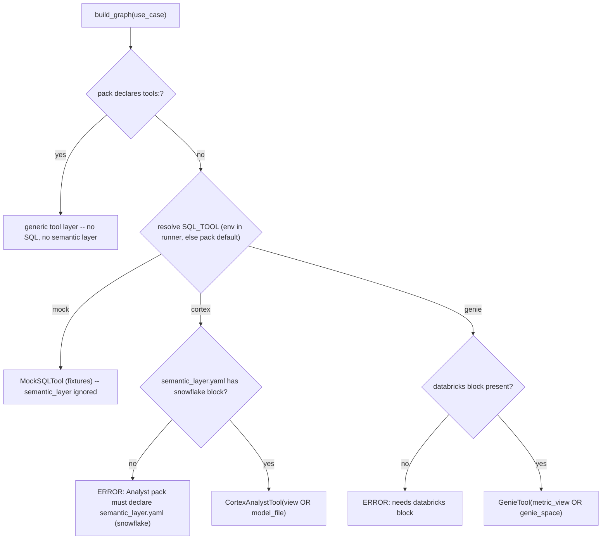

# Plan: Per-pack semantic-layer declaration (dedicated file)

## Context

**Problem.** The semantic object a Cortex Analyst pack queries is read ONLY from a global env var (`CORTEX_SEMANTIC_VIEW` / `CORTEX_SEMANTIC_MODEL`) inside `CortexAnalystTool.__init__` ([engine/sql_tool.py:104-112](engine/sql_tool.py)). A pack cannot declare its own layer; the gap was masked because the one routinely-live pack (`inventory_balance`) matched the single `.env` value.

**Decisions locked with you.**
- Name: `semantic_layer` (no "schema").
- Placement: a **dedicated per-pack file** `usecases/<pack>/semantic_layer.yaml`. File PRESENCE = "this is an AI+BI/Analyst pack"; absence = not AI+BI (engine never looks). Mirrors the existing file-presence pattern used for prompts.
- Scope: **functional config only**. `engine/` reads the pack, NOT env. Credentials stay runtime-injected (see boundary below).

**Design principle to persist (memory, at implementation start).** `.env` is a TEST-ONLY shim for *functional* config. `engine/` source must never read env for functional pack config (semantic layer, business rules) -- it reads the pack. Any env-vs-pack precedence ("use env if present, else pack") lives ONLY in the test/runner scripts (`run_local.py`, `run_evals.py`, tests). Credentials/identity (OAuth token, PAT, account, warehouse) are a SEPARATE category, supplied by the runtime environment / SPCS injection ([spec.yaml:7-10](engine/platform_snowflake/spec.yaml)), never committed and never in pack files.

**Guard rails (both sides).**
1. Missing/invalid on an AI+BI pack: `SQL_TOOL=cortex|genie` but no file (or the active-platform block is missing/empty) -> clear, actionable error naming the pack + accepted keys.
2. Irrelevant agent: a pack with no file never triggers a semantic-layer lookup. Structurally reinforced -- tools packs (`use_sql is False`) never reach `get_sql_tool`, and `SQL_TOOL=mock` ignores the layer (uses fixtures). The error only fires when you explicitly select a live Analyst/Genie tool for a pack that declared nothing.

**Resolution + guard-rail flow**



**File shape** (`usecases/goa_spend/semantic_layer.yaml`):
```yaml
# Presence of this file marks the pack as AI+BI/Analyst-backed.
# engine/ reads this (NOT env). Declare the active platform's block.
snowflake:
  view: DB_ENTERPRISE_DW_VAL.GSC_PROCUREMENT.INDIRECT_SPEND   # a native Semantic View
  # --- OR exactly one of view / model_file ---
  # model_file: "@DB.SCHEMA.STAGE/indirect_spend.yaml"        # semantic-model YAML on a stage
databricks:                                                    # optional; ready for when Genie is wired
  metric_view: main.gsc.indirect_spend_metrics                 # OR  genie_space: <space-id>
```
`view` wins if both `view` and `model_file` are set (mirrors prior env precedence).

## Implementation steps

1. **Engine loader + guard rails** ([engine/graph.py](engine/graph.py)). Add `load_semantic_layer(use_case) -> dict | None`: read `usecases/<pack>/semantic_layer.yaml` if present, else `None`. Pack-only, NOT part of `config.yaml` inheritance/merge (a pack's binding is inherently pack-specific). No env reads.

2. **SQL-tool refactor** ([engine/sql_tool.py](engine/sql_tool.py)).
   - `CortexAnalystTool.__init__(self, semantic: dict)` -- **remove the `os.getenv` reads**; resolve `view`/`model_file` from the passed dict (view wins; neither -> clear error). Keep "resolve BEFORE opening the Snowpark session."
   - `get_sql_tool(use_case=None, default="mock", semantic_layer=None)` -- after resolving the tool name: `mock` ignores `semantic_layer`; `cortex` requires `semantic_layer["snowflake"]` (else guard-rail error) and passes it; `genie` passes `semantic_layer.get("databricks")` (stub still raises NotImplementedError until wired).

3. **build_graph wiring + DI seam** ([engine/graph.py:251-252](engine/graph.py)). For SQL packs: `semantic = semantic_layer or load_semantic_layer(use_case)` then `get_sql_tool(use_case, cfg.get("default_sql_tool","mock"), semantic)`. Add optional `semantic_layer: dict | None = None` param to `build_graph` -- a dependency-injection seam consistent with the existing `sql`/`llm`/`eval_llm` params. build_graph itself reads NO env.

4. **Runner-only env override** ([run_local.py](run_local.py), [run_evals.py](run_evals.py)). In these test/runner scripts (already the `.env`-loading layer), read `CORTEX_SEMANTIC_VIEW`/`CORTEX_SEMANTIC_MODEL`; if set, build `{"snowflake": {...}}` and pass as `build_graph(..., semantic_layer=override)`. This is the ONLY place env-vs-pack precedence exists.

5. **Backfill the 4 Analyst packs** -- create `semantic_layer.yaml` in `inventory_balance`, `goa_spend`, `icertis_procurement`, `procurement_contracts` (verbatim native views), and delete the now-obsolete "set CORTEX_SEMANTIC_VIEW..." comments from their `config.yaml`. Mock/tools/HTTP packs (`dq_qals`, `kpi_analytics`, `anomaly_rca`, `parity_hana_snowflake`, `api_assistant`) get NO file (guard rail #2 by absence).

6. **_TEMPLATE** -- add `usecases/_TEMPLATE/semantic_layer.example.yaml` (doc-only, non-active name so the template stays mock-runnable) showing the platform-keyed shape + the "presence = AI+BI; engine reads pack, not env" note.

7. **Docs + memory.** Update [docs/concepts/use-case-pack-anatomy.md](docs/concepts/use-case-pack-anatomy.md) (add the file to the skeleton + a "Semantic layer (Analyst/Genie packs only)" subsection covering presence semantics, platform-keyed shape, guard rails, and the functional-config-vs-credentials boundary). Update [CLAUDE.md](CLAUDE.md) composition rules (semantic_layer.yaml: pack-only, not inherited, presence = AI+BI; engine reads pack not env). Relabel `CORTEX_SEMANTIC_VIEW`/`MODEL` in [.env.example](.env.example) as TEST-ONLY runner overrides pointing to the pack file as source of truth. Persist the "env is test-only for functional config" principle to memory.

## Verification
- `py -3 -W ignore -m pytest -q` -- expect the current 198 + new engine tests green; existing packs unchanged (all default to `mock`, which ignores the layer).
- **New engine unit tests** ([tests/test_tools_engine.py](tests/test_tools_engine.py)), no network, **no references to the 3 new packs**: `CortexAnalystTool(semantic={"view":...})` resolves (env patched EMPTY, proving env is not read); `{"model_file":...}` path; view-wins; neither -> error; `get_sql_tool(SQL_TOOL=cortex, semantic_layer=None)` -> guard-rail error; `SQL_TOOL=mock` ignores the layer; `load_semantic_layer` returns dict vs None against a `tmp_path`.
- **Optional single live smoke** (authorized, costs credits): run ONE mirrored pack with `SQL_TOOL=cortex` and `CORTEX_SEMANTIC_VIEW` UNSET -- proving the pack self-declares its view with no env. One pack only, to stay cheap.

## Critical Files
- [engine/sql_tool.py](engine/sql_tool.py) - `CortexAnalystTool` loses its env reads; `get_sql_tool` gains `semantic_layer` + platform selection + guard-rail errors.
- [engine/graph.py](engine/graph.py) - new `load_semantic_layer`; `build_graph` loads the pack file and threads it, plus the DI override param.
- [run_local.py](run_local.py) / [run_evals.py](run_evals.py) - the ONLY place the env override (test precedence) is read.
- [usecases/_TEMPLATE/semantic_layer.example.yaml](usecases/_TEMPLATE/semantic_layer.example.yaml) - authoring template for new AI+BI packs.
- [docs/concepts/use-case-pack-anatomy.md](docs/concepts/use-case-pack-anatomy.md) - documents the file, guard rails, and the config-vs-credentials boundary.

## Out of scope
- GenieTool stays a stub; we only define/document its config shape.
- Per-pack warehouse/role: warehouse is a *connection/identity* concern (category 2), so it stays env/SPCS for now -- consistent with "functional config only." A pack needing a specific warehouse (e.g. `procurement_contracts`) sets it per-deployment; noted as a known limitation, not this PR.
