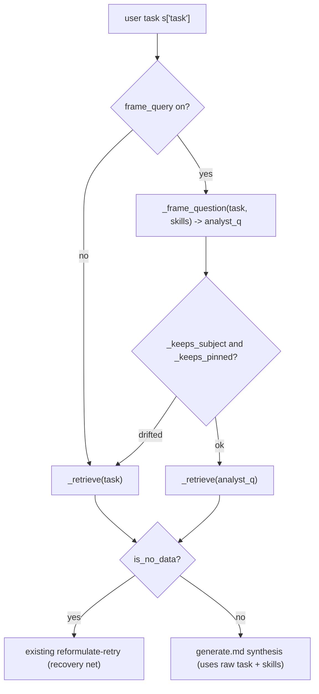

# Plan: skill-informed query framing (plumbing first, then decide)

## Context (what I explored, verified)

**Root cause (proven live).** `goa_spend` "average invoice amount for the IT Software category" escalates `no_data`, but the native agent answers it.
- `"IT Software"` is a value of the `ExecutiveCategory` column (22,364 rows); it does not exist in `SpendCategory` (0 rows). The view has ~13 category-like columns, no synonyms/sample values.
- Our pipeline sends the raw question to Analyst ([engine/graph.py](engine/graph.py) line 561 -> `_retrieve` -> `sql.ask`). Analyst guesses the wrong column -> 0 rows -> escalate.
- Native `GOA_SPEND_ANALYTICS_AGENT` uses the same semantic view, but attaches a skill `category_drilldown` enumerating the hierarchy ("ExecutiveCategory (L1): IT Software, ...") + trigger phrases; its orchestration LLM uses that to frame the Analyst question.
- Proof (same tool, same view): raw -> 0 rows; framed "average InvoiceUSD where `ExecutiveCategory` is 'IT Software'" -> $21,339.34.

**The abstraction gap.** `load_skills()` output ([engine/graph.py](engine/graph.py) line 517) is injected only into `generate.md` (synthesis, line 613) and `refine.md` (line 677) - never into query formulation. So domain knowledge arrives one step too late.

**The content gap (the accountability point).** The native agent has 10 skills (`category_drilldown`, `compliance_scorecard`, `contract_renewal`, `cost_center_gl_lookup`, `non_po_concur_spend`, `regional_currency_filter`, `tail_spend_consolidation`, `time_comparison`, `top_n_ranking`, `vendor_spend_lookup`) plus a large instructions block. Our pack ships one condensed skill ([usecases/goa_spend/skills/spend_rules.md](usecases/goa_spend/skills/spend_rules.md)) and no pack instructions. The packs are a thin reimplementation, not a mirror. `category_drilldown` - the skill that would fix IT Software - was never ported.

**Chosen scope: "plumbing first, then decide."** Build the generic mechanism, port only `category_drilldown` into `goa_spend`, prove the fix, then decide (separately) how much of the remaining 9 skills / instructions / other 3 packs to port. Doing plumbing first means later porting is just authoring skill files - no further engine work.

## Design

Principles: engine stays domain-free; knowledge lives in a pack skill. Framing reuses the hardened drift guards, and any drift or error falls back to the raw task (fail-safe: framing can never create a new escalation). Opt-in per pack; enabled on `goa_spend` only for this proof.

## Implementation steps

1. **`shared/prompts/frame.md` (new).** Prompt: given the user QUESTION and pack SKILLS (which describe dimensions/measures/scope), output ONE Analyst-ready question that names the correct dimension/measure and states scope; must NOT change the subject or drop identifiers; if nothing to clarify, echo the question verbatim. Pack-overridable via `usecases/<pack>/prompts/frame.md` (same `_prompt` resolution). Sent verbatim to the model - no author-only notes.

2. **`_frame_question(task, skills)` helper + `frame_query` flag in [engine/graph.py](engine/graph.py).** One `llm.complete` over `frame.md` with `{skills}`+`{task}`; strip/bound the output; on empty/error return the raw task. Read `frame_query` via `strict_bool` (default `false` in `shared/config.yaml`), mirroring `zero_is_no_data`.

3. **Wire into `generate()` at line 561.** When `frame_query` and `use_sql` (or deterministic tools): `analyst_q = _frame_question(...)`; validate with `_keeps_subject`/`_keeps_pinned`; on drift or failure use `s["task"]`. Call `_retrieve(analyst_q, run_id)`. Keep `s["task"]` unchanged for synthesis and guards. The existing reformulate-retry (lines 573-610) stays as the recovery net. (Optional, same change: also pass `{skills}` into `reformulate.md` so recovery is skill-informed.)

4. **Port `category_drilldown` into `goa_spend` (content).** Read the native `@OPERATIONS_DEV.OPERATIONS_SANDBOX.PROCUREMENT_SKILLS_STAGE/skills/category_drilldown/SKILL.md` and author a faithful `usecases/goa_spend/skills/category_map.md` (the L1 `ExecutiveCategory` values incl. IT Software, the InvoiceUSD measure, categorized-vs-all scope). Set `frame_query: true` in [usecases/goa_spend/config.yaml](usecases/goa_spend/config.yaml) only.

5. **Unit tests (`tests/`, isolated).** Mock worker frames "...IT Software category" -> "...ExecutiveCategory = 'IT Software'"; assert the SQL-tool double receives the framed question; assert a subject-substituting frame is discarded -> raw task used; assert `frame_query` off = byte-identical to today; toolless/agentic paths unaffected.

## Verification
- **Offline:** `py -3 -W ignore -m pytest -q` (full suite green + new framing tests). Mock sweep (all packs build/answer). Golden evals unchanged.
- **Live proof (goa_spend, one process, creds from .env):** the IT Software question now returns a scored answer (~$21,339.34 avg, target 16-18, `status=ok`). Re-run the Round 5 goa_spend set (3 pos + 3 neg) to confirm no positive regressions and negatives still escalate `out_of_scope`/`no_data`. Confirm the other 3 packs (framing still off) are byte-identical.
- **Decision gate (no code):** with the mechanism proven, decide how much of the remaining native skills/instructions and the other 3 packs to port - now just authoring skill files, no engine work.

## Critical Files
- [engine/graph.py](engine/graph.py) - `generate()`/`_retrieve` (line 536-561), add `_frame_question` + `frame_query` gate + guard reuse; the core change.
- [shared/prompts/frame.md](shared/prompts/frame.md) - new query-formulation prompt (generic).
- [usecases/goa_spend/skills/category_map.md](usecases/goa_spend/skills/category_map.md) - new; faithful port of native `category_drilldown` (the content that fixes IT Software).
- [usecases/goa_spend/config.yaml](usecases/goa_spend/config.yaml) - set `frame_query: true` (proof pack only); `shared/config.yaml` holds the `false` default.
- [tests/test_grounding.py](tests/test_grounding.py) - add framing tests alongside the existing drift-guard tests.
