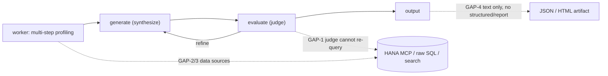

# Framework Capability Gaps

**Status:** analysis only (no code change implied by this document)
**Date:** 2026-09-16
**Lens:** grounded in porting the CoCo `hana-insights` / `snowflake-insights` agents into this framework, plus a full read-only capability inventory (file:line cited).

## Purpose

The goal for `portable-agent` is to be *configurable* to **most common** agent use-cases — not every conceivable one, but the common shapes (analytics/insight agents, conversational assistants, action/workflow agents, broad-source data agents). This document records where the framework falls short of that goal today, with a severity and a config-vs-code note per gap, so the gaps can be prioritized deliberately.

This is a documentation deliverable. Each gap's "fix shape" is indicative, not a commitment.

## What the framework already does well (baseline — keep)

- **Core agent loop is native:** generate -> evaluate -> refine with a scored rubric, escalation/grounding guards, and independently selectable worker/judge models (`engine/graph.py:838-846`).
- **Multi-step tool use** works via `tool_mode: agentic` and `tool_mode: planned` (validated live end-to-end).
- **Provider/model config is strong:** worker and judge chosen independently by env or pack `models:`; providers anthropic / cortex / databricks / litellm / mock (`engine/llm_client.py:319-322`, `:372-375`).
- **Safety spine:** strict approval gate, per-call timeout, redaction, and a single `dispatch()` trust boundary for every tool (`engine/tools/dispatch.py:104`).
- **Pack-as-config** for existing tool types; a portable git-based eval harness; tracing / event-table observability.

## Where the gaps sit in the loop

## Gap register

| ID | Gap | Common use-cases it blocks | Today (evidence) | Severity | Config or code to close |
|----|-----|----------------------------|------------------|----------|--------------------------|
| GAP-1 | **Evaluator/verifier has no tool access** (judge scores text only) | Any agent that must verify answers against live data: analytics, insights, data-QA, reconciliation | Judge parses a `Verdict(score, reason)` from text; the eval node never calls `dispatch()` (`engine/graph.py:248-259`). The CoCo insight evaluator re-runs a <=2-query ground-truth spot-check | High | Code (new "judge-with-tools" eval path) |
| GAP-2 | **Narrow data-source breadth** | Agents over raw Snowflake SQL, catalog/object search, HANA, Postgres/other DBs, files | SQL providers = `mock \| cortex \| genie`; `cortex` is **semantic-view-bound text-to-SQL**, not arbitrary SQL or catalog search (`engine/sql_tool.py:255-265`). No HANA/other-DB provider | High | Code (new SQL providers + tools) |
| GAP-3 | **MCP integration unfinished** | The whole MCP tool ecosystem (HANA, dbt, Atlassian servers already configured on this machine) | The `mcp` adapter EXISTS + is registered and the `mcp` SDK is already a dependency, but it is stdio-only, one tool per entry, `input_model=None` (no arg schema), surfaces only text content, likely spawns the server per call, and is untested (`engine/tools/mcp_tool.py`) | High | Code (finish the adapter) |
| GAP-4 | **Output is free text only — no declarable structured output** | Agents returning JSON/records, extracted fields, a classification, a report object, or a rendered artifact | Final output is `best_answer` (string) plus a fixed `AskResponse` envelope; no per-pack output schema/validation (`engine/platform_snowflake/agent.py:59-67`). The CoCo insight worker emits a JSON content object + a deterministic HTML render | Medium-High | Code (optional pack output schema + emit/render step) |
| GAP-5 | **No memory / multi-turn / conversational state** | Chat assistants, follow-up questions ("the 8 items from before"), session continuity | Stateless: fresh `initial_state` + new run_id per call (`engine/graph.py:849-854`); the memory store is **write-only capture with no recall** (`engine/memory.py:46-50`, `:8-15`); multi-turn is "deliberately parked" (`chat_local.py:13-14`) | Medium-High | Code (read-back memory + thread/session id) |
| GAP-6 | **No human-in-the-loop / write execution / approve-resume** | Action/workflow agents: create tickets, write rows, run DML with approval | An approval gate exists but `approved` is **never set True** in engine code, so writes are always refused; there is no interrupt/resume node (`engine/tools/dispatch.py:104`, `engine/tools/orchestrator.py:111`) | Medium | Code (interrupt/resume + approval grant) |
| GAP-7 | **No batch / fan-out in one invocation** | "Document all N views", "score every object", list processing | One task per `traced_invoke`; batch is only an external sequential loop (`run_evals.py:27-29`). The CoCo orchestrator adds a per-view concurrency + in-flight registry layer | Medium | Code (batch/map runner above the graph) |
| GAP-8 | **Synchronous only — no streaming/async/jobs** | Streamed chat UX, long-running profiling, background jobs | `graph.invoke` is synchronous; no `astream`; `LLMClient.complete` is blocking; no job/queue concept (`engine/tracing.py:295`) | Medium (UX) / Low (batch via scheduler) | Code (async invoke + streaming shell) |
| GAP-9 | **New integration = code, not config** (the meta-gap) | The core vision: "configurable to most use-cases" without engineering per source | Packs are config + skills + prompts, but tool **types** and SQL **providers** require a Python adapter + `register(...)` (`engine/tools/registry.py:25-45`). Only *existing* types are pure config | Medium | Code once, then config (generic connectors) |

## Reading the gaps by use-case archetype

- **Analytics / insight / data-QA agents** (the ones analyzed): blocked mainly by **GAP-1** (verifier can't re-check), **GAP-2/3** (data breadth: raw SQL, catalog search, HANA via MCP), and **GAP-4** (structured/report output). The loop, rubric, and multi-step profiling already fit.
- **Conversational assistants:** blocked by **GAP-5** (memory/multi-turn) and **GAP-8** (streaming).
- **Action / workflow agents:** blocked by **GAP-6** (HITL write execution).
- **"Any source" agents:** blocked by **GAP-2/3/9** (breadth + the config-vs-code boundary).

## Recommended priority (highest leverage for common use-cases)

1. **GAP-3 finish MCP** + **GAP-2 a generic read-only SQL / object-search tool** — together these unlock the largest set of data agents with the least per-source code (MCP alone reaches HANA, dbt, Atlassian, ...).
2. **GAP-1 judge-with-tools** — the single biggest *grounding-fidelity* gap for data agents; without it, verification is prose-only.
3. **GAP-4 structured output contract** — needed for report/JSON-emitting agents and clean downstream integration.
4. **GAP-9 generic config-driven connectors** — turns "add a source" from code into config for common cases (generic REST is partly there via the `http` tool).
5. **GAP-5 / GAP-6 / GAP-7 / GAP-8** — enable the conversational, action, batch, and streaming archetypes respectively; sequence by which archetype is wanted next.

## Explicitly out of scope (by design — a conscious boundary, not an oversight)

- **RAG / vector / long-term semantic memory** is deliberately deferred to native services (Cortex Search / Databricks Vector Search) wrapped behind a tool, per the code's own note (`engine/memory.py:11-14`). Listed here so it reads as an intentional boundary. Revisit only if the product vision changes.

## Notes

- This analysis was read-only; nothing in `engine/`, the packs, or the native CoCo agents/plugins was modified.
- "Severity" is relative to the common-use-case goal, not to any single customer.

## Evidence anchors (read-only references)

- `engine/graph.py` — loop, State schema, judge `Verdict` parsing, stateless `initial_state` (GAP-1, GAP-4, GAP-5).
- `engine/tools/mcp_tool.py` — the unfinished MCP adapter (GAP-3).
- `engine/sql_tool.py` — SQL provider set; `cortex` is semantic-view-bound (GAP-2).
- `engine/tools/registry.py` — tool-type registration = the config-vs-code boundary (GAP-9).
- `engine/memory.py` — write-only capture; RAG/multi-turn deferred (GAP-5, scope note).
